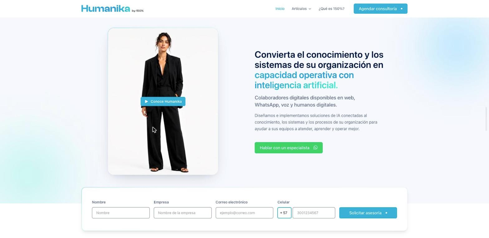
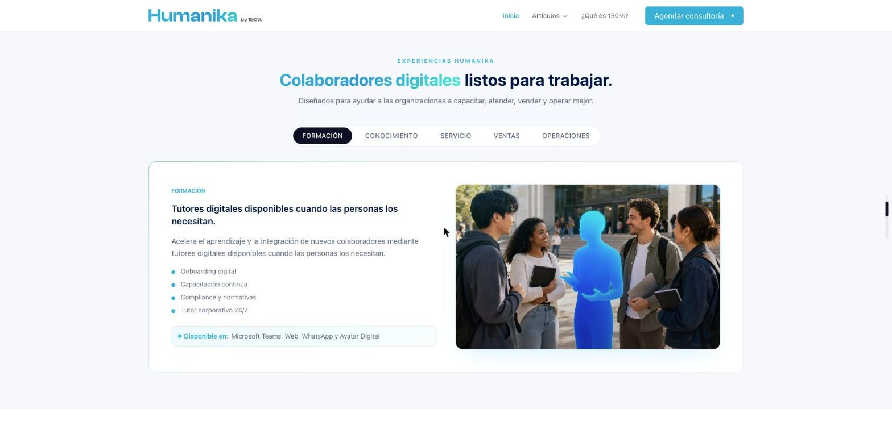
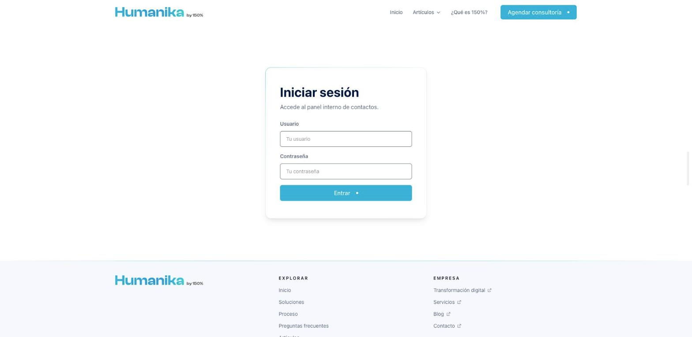
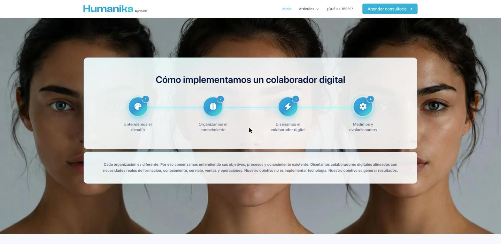
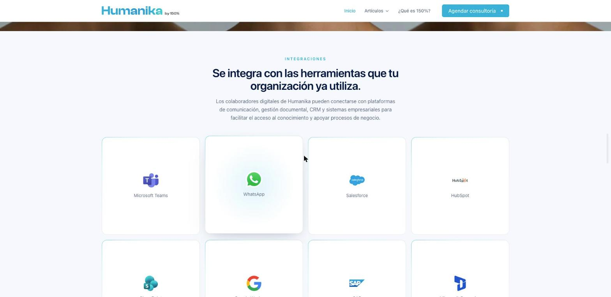
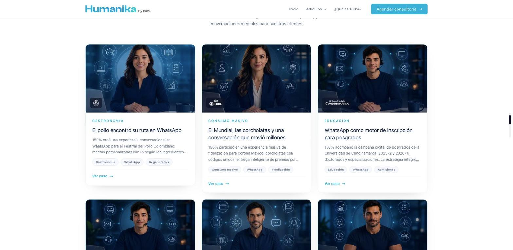
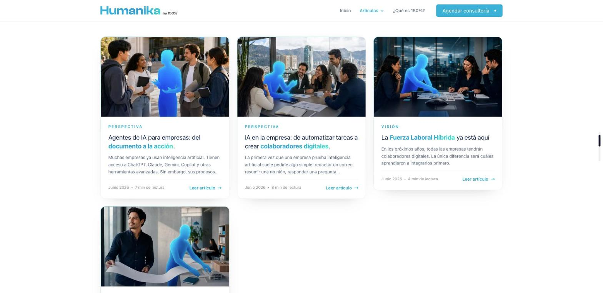
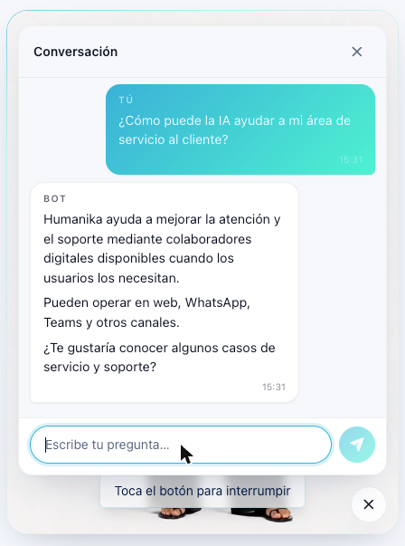

<div align="center">

# Humanika — Sitio público

**Colaboradores digitales de IA en web, WhatsApp, voz y humanos digitales.**

[](https://nextjs.org)
[](https://react.dev)
[](https://www.typescriptlang.org)
[](https://tailwindcss.com)
[](https://www.prisma.io)
[](https://platform.openai.com)

</div>

<div align="center">
  
</div>

---

## Qué es esto

**Humanika** —una iniciativa de **150 Por Ciento**— diseña e implementa colaboradores digitales de inteligencia artificial conectados al conocimiento, los sistemas y los procesos de una organización, para ayudar a sus equipos a atender, capacitar y operar mejor.

Este repositorio es el **sitio público**: la portada comercial, los casos de éxito, los artículos, el formulario de captación de leads y el panel interno donde el equipo consulta los contactos recibidos. Lo que lo distingue de una landing corriente es que la portada **no explica** qué es un colaborador digital: te deja hablar con uno. El avatar del hero escucha por micrófono o por texto, clasifica la intención y responde con el video correspondiente.

> [!NOTE]
> La interfaz está en **español** (`es` es el único locale activo en `next.config.ts`). La infraestructura de i18n con `next-i18next` está montada y hay traducciones `en` listas en `public/locales/en/`: activar el inglés es añadirlo a `locales`.

---

## Capturas

<table>
<tr>
<td width="55%">

<p align="center"><em>Experiencias por área — una pestaña por tipo de colaborador digital</em></p>
</td>
<td width="45%">

<p align="center"><em>Acceso al panel interno de contactos</em></p>
</td>
</tr>
<tr>
<td>

<p align="center"><em>Proceso de implementación en 4 pasos</em></p>
</td>
<td>

<p align="center"><em>Rejilla de integraciones</em></p>
</td>
</tr>
<tr>
<td>

<p align="center"><em>Casos de éxito — 6 casos reales de bots de WhatsApp</em></p>
</td>
<td>

<p align="center"><em>Artículos — contenido en TypeScript, no en Markdown</em></p>
</td>
</tr>
</table>

---

## Qué incluye

| Zona | Ruta | Qué hace |
| --- | --- | --- |
| **Portada** | `/` | Hero con avatar conversacional, formulario de contacto, marcas cliente, experiencias por área, proceso, integraciones y FAQ. |
| **Avatar** | embebido en `/` | Colaborador digital de demostración: voz, texto, video y clasificación de intención. Ver abajo. |
| **Casos de éxito** | `/casos-de-exito` · `/casos-de-exito/[slug]` | 6 casos reales. Una sola ruta dinámica alimentada por un registro central. |
| **Artículos** | `/blog` · `/blog/[slug]` | 4 artículos. El contenido es un árbol tipado de TypeScript que renderiza `ArticleRenderer`, no Markdown. |
| **Contacto** | `/` → `POST /api/contact` | Guarda el lead en Postgres y dispara dos correos (confirmación al lead + aviso al equipo). Protegido con reCAPTCHA v3 y rate limit. |
| **Panel interno** | `/login` → `/dashboard` | Consulta de los contactos recibidos. Sesión por cookie firmada con HMAC. |
| **Legales** | `/privacy` · `/terms` | Política de privacidad y términos. |

### Publicar contenido sin escribir una página

Casos de éxito y artículos comparten el mismo patrón: un **registro central** más un fichero de copia. No se crea ningún fichero en `pages/`.

```
1. public/locales/<locale>/<slug>.json          la copia visible
2. src/features/<case-studies|article>/data/    el contenido estructurado
3. una entrada en el registro                   .registry.ts
```

El listado, la ruta `/<sección>/<slug>` y la sección de la portada lo recogen automáticamente. Ver [`case-studies.registry.ts`](src/features/case-studies/data/case-studies.registry.ts) y [`articles.registry.ts`](src/features/article/data/articles.registry.ts).

---

## El avatar conversacional



Es la pieza menos obvia del repositorio y vive en [`src/features/bot/`](src/features/bot).

**El bucle:** el usuario habla (Web Speech API) o escribe → `POST /api/bot` clasifica la intención → devuelve un `scriptId` → el reproductor carga `/videos/<scriptId>.mp4` y muestra el texto en el chat.

**La clasificación** ([`classify-script.ts`](src/features/bot/server/classify-script.ts)) es un port de un analizador previo en Python y tiene dos motores:

1. **GPT** (`gpt-4o-mini` por defecto) como método principal, con el historial acotado a los últimos 6 turnos.
2. **Palabras clave** como respaldo, cuando no hay `OPENAI_API_KEY`, cuando `USE_GPT_ANALYZER=False`, o cuando GPT devuelve una confianza por debajo de 0.5.

El orden de prioridad está fijado a mano: CTA explícito → manejadores especiales (clima, groserías, piropos, charla, cierre) → fuera de alcance → mejor guion temático → «no entendí». Hay **32 guiones** en [`humanika-scripts.json`](src/features/bot/data/humanika-scripts.json) y 35 videos en `public/videos/`; si a un guion le falta su `.mp4` se cae a un video de espera en vez de romper el reproductor.

**La voz** entra por dos caminos: reconocimiento nativo del navegador (`useSpeechRecognition`) y, como alternativa, grabación enviada a `POST /api/transcribe`, que la pasa por Whisper. Alrededor hay control de permisos de micrófono, medidor de nivel de audio, temporizador de inactividad y pantalla de error.

<br clear="right">

---

## Arquitectura

### Capas

```
pages/<ruta>/index.tsx          Página fina: carga traducciones y SEO, delega la UI
  └── src/features/<módulo>/
        views/                  <Feature>.view.tsx — raíz del módulo
        components/             Componentes propios del módulo
        actions/                Llamadas a /api/*
        hooks/                  Estado y lógica del módulo
        stores/                 Zustand con alcance de módulo
        data/                   Registros y contenido estructurado
        validations/            Esquemas Zod
src/shared/                     Transversal: components, layouts, stores, libs, emails…
pages/api/                      Backend: contacto, bot, transcripción, auth, admin
```

10 módulos de negocio y 17 componentes compartidos. Los estilos de componente son **CSS Modules** co-localizados; Tailwind queda para utilidades de layout.

### Decisiones que conviene conocer antes de tocar el código

- **Pages Router**, no App Router. No existe directorio `app/`.
- **Next.js 16**: sus APIs y convenciones difieren de versiones anteriores. El *middleware* se llama ahora `proxy.ts` — aquí solo fija la cookie de idioma de `next-i18next`.
- **Prohibidos los barrel files.** Nada de `index.ts` que reexporte: se importa siempre del fichero fuente. Encarecen el build y rompen el *tree-shaking*.
- **Nada de texto en el JSX.** Toda la copia vive en `public/locales/<locale>/<namespace>.json`. `useTranslation` se llama solo en las páginas y en `_app.tsx`; el `t` baja como prop tipada `ITranslations`.
- **Cero clases Tailwind de diseño en los `.tsx`.** Colores, espaciado y tipografía salen de los tokens de `@theme inline` en `globals.css` a través del `*.module.css` del componente.
- **Toda animación es Framer Motion.** Sin transiciones CSS ni otras librerías, más allá de hovers estáticos.
- **El SEO va por `PageLayout`**, no por `<Head>` suelto: canonical, Open Graph, Twitter card, JSON-LD y robots en un solo sitio.

### Stack

| Área | Elección |
| --- | --- |
| Framework | Next.js 16.2.6 (Pages Router, Turbopack) · React 19.2 |
| Lenguaje | TypeScript 5, `strict` |
| Estilos | Tailwind CSS 4 (*CSS-first*) + CSS Modules |
| Datos | Prisma 6 + PostgreSQL |
| Estado | Zustand 5 (toast, loader, lenis, tema, bot, chat) |
| Formularios | React Hook Form + Zod 4 |
| Animación | Framer Motion · Lenis (*smooth scroll*) |
| i18n | next-i18next 16 |
| Correo | Nodemailer sobre SMTP de Brevo |
| IA | OpenAI — `gpt-4o-mini` (intención) y `whisper-1` (voz) |
| Antibots | reCAPTCHA v3 + rate limit en memoria |
| Iconos | Font Awesome |

### Seguridad del formulario

Tres capas sobre `POST /api/contact`, en este orden:

1. **CORS** con lista blanca de orígenes (`SITE_URL`, más `localhost` en desarrollo).
2. **Rate limit** por IP — 40 peticiones por minuto ([`rate-limit.ts`](src/shared/libs/rate-limit.ts)). Vive en memoria, así que se reinicia en cada arranque en frío.
3. **reCAPTCHA v3** ([`recaptcha.ts`](src/shared/libs/recaptcha.ts)) — se valida el token contra Google **antes** de escribir en la base de datos o enviar correos. Se rechaza si el token es inválido, si la acción no coincide o si el score baja de `RECAPTCHA_MIN_SCORE`. Si Google no responde, el lead pasa: una caída suya no debe apagar la captación.

El script de reCAPTCHA **no se carga al entrar a la página**: se inyecta cuando el usuario toca el primero de los 5 campos del formulario ([`useRecaptcha.ts`](src/shared/hooks/useRecaptcha.ts)).

El panel interno usa una cookie `httpOnly` firmada con HMAC-SHA256 y 8 horas de vigencia ([`session.ts`](src/shared/libs/session.ts)), validada tanto en el `getServerSideProps` del dashboard como en `/api/admin/*`. La contraseña del admin se guarda hasheada con scrypt.

---

## Puesta en marcha

### Requisitos

- Node.js 20 o superior
- Una base de datos PostgreSQL
- Cuenta de Brevo (SMTP), clave de OpenAI y claves de reCAPTCHA v3 — todas opcionales en desarrollo, pero sin ellas se cae la funcionalidad que dependa de cada una

### Instalación

```bash
git clone https://github.com/jhosuapp/nextjs-bot.git
cd nextjs-bot
npm install
cp .env.example .env     # y rellena los valores
npx prisma migrate dev   # crea las tablas
npm run seed             # crea el usuario admin del panel
```

### Variables de entorno

| Variable | Obligatoria | Descripción |
| --- | --- | --- |
| `DATABASE_URL` | Sí | Cadena de conexión de PostgreSQL. |
| `AUTH_SECRET` | Sí | Secreto para firmar la cookie de sesión del panel. Mínimo 16 caracteres: `openssl rand -hex 32`. |
| `BREVO_SMTP_HOST` | Correo | Host SMTP. Usa el nombre legado `smtp-relay.sendinblue.com`: algunos nodos de Brevo presentan certificados cuyos *altnames* no incluyen `*.brevo.com`. |
| `BREVO_SMTP_PORT` | Correo | Puerto SMTP (587 por defecto). |
| `BREVO_SMTP_USER` · `BREVO_SMTP_PASSWORD` | Correo | Credenciales SMTP. |
| `MAIL_FROM_EMAIL` · `MAIL_FROM_NAME` | No | Remitente de los correos. Por defecto `no-reply@humanika.co` / `150%`. |
| `OPENAI_API_KEY` | Bot | Clasificación de intención y transcripción con Whisper. Sin ella el bot cae al motor de palabras clave y la voz por Whisper deja de funcionar. |
| `OPENAI_MODEL` | No | Modelo del clasificador. Por defecto `gpt-4o-mini`. |
| `MAX_TOKENS` | No | Tope de tokens de la respuesta del clasificador. Por defecto 150. |
| `USE_GPT_ANALYZER` | No | `False` fuerza el motor de palabras clave. |
| `NEXT_PUBLIC_RECAPTCHA_SITE_KEY` | Captcha | Clave de sitio. Viaja al navegador, de ahí el prefijo `NEXT_PUBLIC_`. |
| `RECAPTCHA_SECRET_KEY` | Captcha | Clave secreta. Solo servidor — nunca con prefijo público. |
| `RECAPTCHA_MIN_SCORE` | No | Score mínimo aceptado, de 0.0 a 1.0. Por defecto `0.5`. |
| `SEED_ADMIN_USERNAME` · `SEED_ADMIN_PASSWORD` | No | Sobreescriben las credenciales que crea `npm run seed`. |

> [!IMPORTANT]
> Para probar el captcha en local, añade `localhost` a la lista de dominios de la clave en la [consola de reCAPTCHA](https://www.google.com/recaptcha/admin). Si no, `siteverify` responde `browser-error` y el formulario devuelve `403` aunque el código esté bien.

### Comandos

```bash
npm run dev      # prisma generate + servidor de desarrollo
npm run build    # build de producción
npm run start    # sirve el build de producción
npm run lint     # ESLint
npm run seed     # crea o actualiza el usuario admin del panel
```

> [!NOTE]
> No hay *test runner* configurado. La verificación previa a un cambio es `npm run lint`, `npm run build` y una comprobación real en el navegador.

---

## Base de datos

Dos tablas, definidas en [`prisma/schema.prisma`](prisma/schema.prisma): `ContactForm` (los leads) y `AdminUser` (las cuentas del panel).

```bash
npx prisma studio                              # explorar los datos en el navegador
npx prisma migrate dev --name <nombre>          # crear y aplicar una migración
npx prisma db pull                              # sincronizar el esquema desde una BD existente
npx prisma generate                             # regenerar el cliente
```

---

## Correo

Dos plantillas HTML en [`src/shared/emails/`](src/shared/emails), sin librería de plantillas: confirmación al lead y aviso al equipo. Se previsualizan sin enviar nada:

```bash
node scripts/render-email-previews.mjs   # genera email-previews/*.html
```

> El correo al equipo va **sin `Reply-To`** a propósito: Brevo rechaza con `554 5.7.7` los envíos cuyo `Reply-To` es un dominio de webmail gratuito. El correo del lead viaja en el cuerpo del mensaje.

---

## Estructura del repositorio

```
├── pages/
│   ├── _app.tsx                Header, Footer, toast, cookies, GTM, smooth scroll
│   ├── _document.tsx           lang y bootstrap del tema antes del primer pintado
│   ├── api/                    contact · bot · transcribe · auth/* · admin/*
│   ├── blog/                   listado y [slug]
│   ├── casos-de-exito/         listado y [slug]
│   └── dashboard/              panel interno
├── src/
│   ├── config/                 constantes del sitio y tipografías
│   ├── features/               10 módulos de negocio
│   ├── shared/                 components, layouts, stores, libs, emails, helpers
│   └── styles/                 Tailwind y estilos globales
├── prisma/                     esquema, migraciones y seed
├── public/
│   ├── locales/{es,en}/        toda la copia visible
│   └── videos/                 35 clips del avatar
├── docs/screenshots/           capturas de este README
├── proxy.ts                    cookie de idioma (el antiguo middleware)
└── CLAUDE.md                   guía para agentes de IA que trabajen en el repo
```

---

## Contribuir

1. Rama desde `main` con un nombre descriptivo.
2. **Ningún texto visible en el JSX**: va a `public/locales/<locale>/<namespace>.json`, con las mismas claves en `es` y en `en`.
3. **Ningún `index.ts`**: se importa siempre del fichero fuente.
4. Estilos de componente en su `*.module.css`, con tokens de la paleta. Nada de hex sueltos ni colores arbitrarios de Tailwind.
5. Animaciones con Framer Motion.
6. Antes del PR: `npm run lint` y `npm run build` en verde.

Antes de escribir código nuevo, lee [`CLAUDE.md`](CLAUDE.md) y la guía de la versión de Next que hay en `node_modules/next/dist/docs/`: esta versión trae cambios de ruptura respecto a lo que probablemente recuerdes.

---

<div align="center">
<sub>Humanika · una iniciativa de <strong>150 Por Ciento</strong></sub>
</div>
